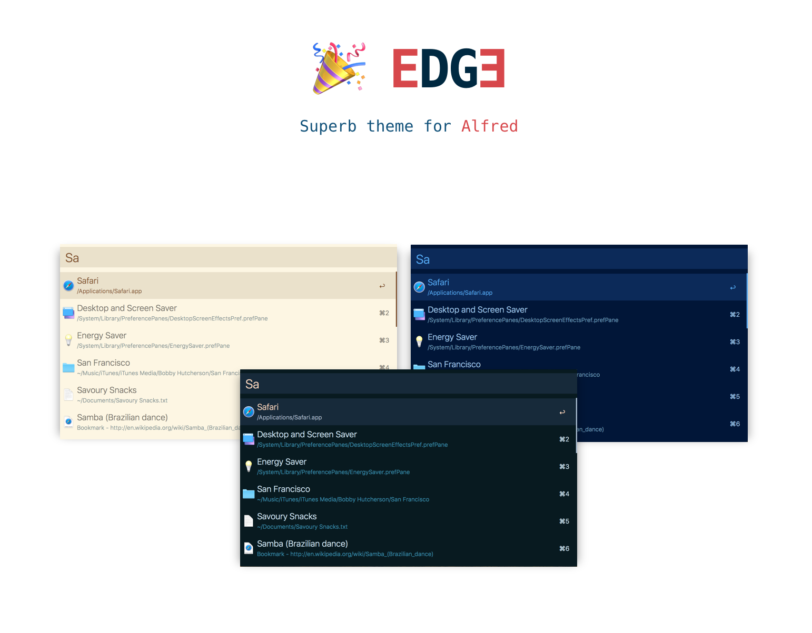
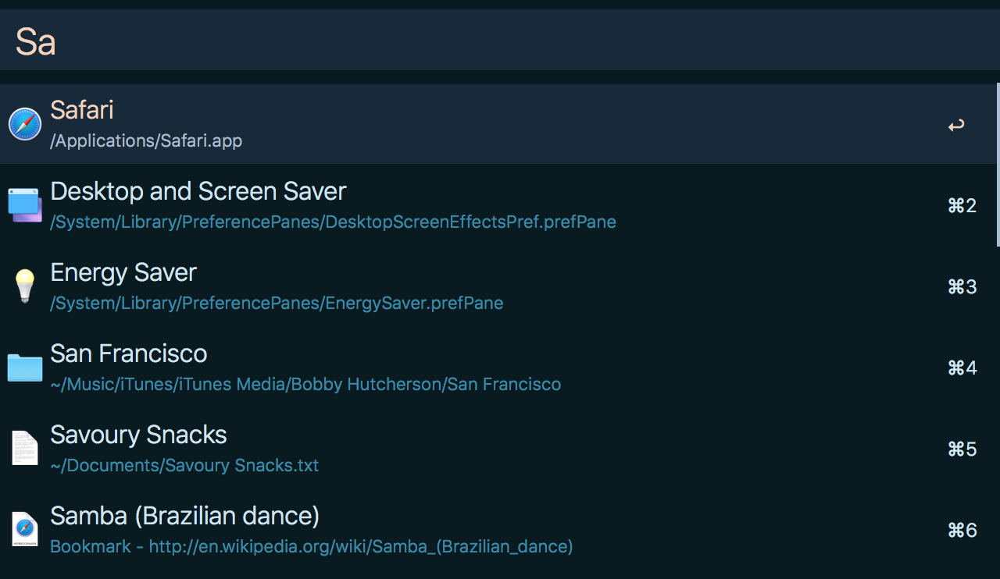
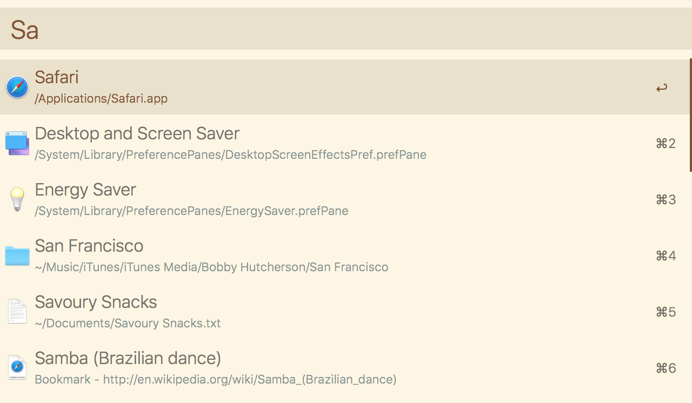
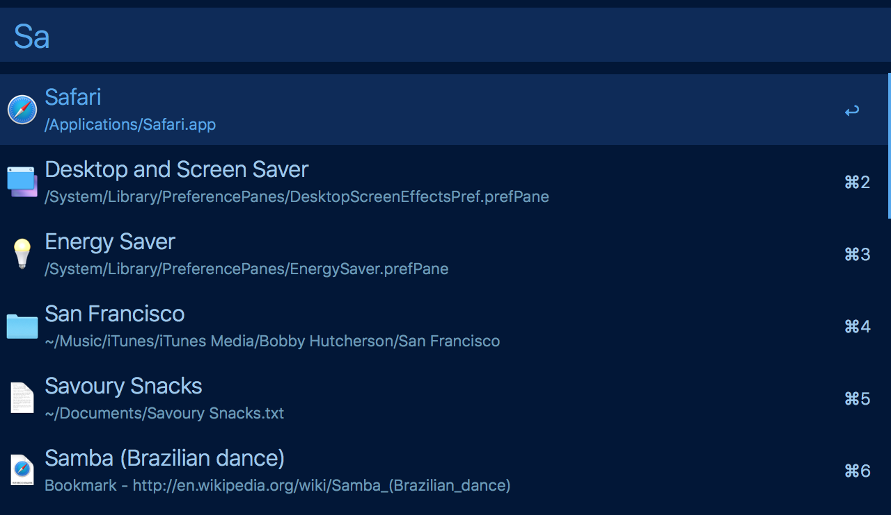

`Edge` is a simple theme with bright colors. Edge comes in three versions — _Night Sky_, _Serene_ and _Ocean_ for all day long comfortable work.

## Installation

[Install the theme.](https://www.alfredapp.com/extras/theme/r0xYNeBQ1P/)

_You need the [Powerpack](https://www.alfredapp.com/powerpack/) for custom themes._

## Activation

Under Alfred's Preferences, select Appearance and then the Edge Theme variant you want to use.

## Screenshots

**Edge Night Sky**

**Edge Serene**

**Edge Ocean**

